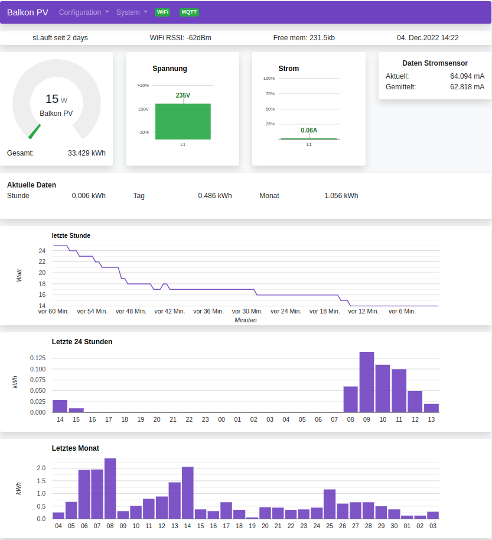

# AMS MQTT Bridge with ACS712 current sensor input
This code is mostly based on AMSToMQTTBridge (https://github.com/gskjold/AmsToMqttBridge) but utilizes a ACS712 current sensors for power calculations (instead of serially reading smartmeters data). ACS712 measurements are used to calculate electrical power (assuming a constant AC voltage). 
This can be used for small Photovoltaic systems. The data is presented in a graphical web interface and data can also be sent to a MQTT broker which makes it suitable for home automation project. 

The code is designed for ESP32 hardware only (so no ESP8266) because of ADC range (max 3.3V) usage. 
Hardware is very simple. 
ACS712's voltage output is used to calculate the AC current without any additional signal conditioning.
A ACS712 module may be used.
The current firmware is set up to use a 5 Ampere Type ACS712, connected to ESP32 pin 36 (= ADC1 Ch 0 = SVP pin). To switch to Wifi AP mode for setup ESP32 pin 26 must be set to GND for > 5 Sec. 
The current measurement can be calibrated by means of slope and offset - see "System --> GPIO" setup web page....field "Multiplier" changes the slope, field "AmpOffset" changes the zero point offset. 
Note: Zero point offset calibration is done automatically at 1:00 - because this software is done of a small PV systems which do not deliver anything at dark night .

u can read more about the original AMS MQTT Bridge in its [WiKi](https://github.com/gskjold/AmsToMqttBridge/wiki). 
For first time flashing the firmware to the ESP32 device please use flashing procedure described in Folder ESP32-binary.

Web interface is mostly translated to German language.



## Building this project with PlatformIO
To build this project, you need [PlatformIO](https://platformio.org/) installed.

It is recommended to use Visual Studio Code with the PlatformIO plugin for development.

[Visual Studio Code](https://code.visualstudio.com/download)

[PlatformIO vscode plugin](https://platformio.org/install/ide?install=vscode)

For development purposes, copy the ```platformio-user.ini-example``` to ```platformio-user.ini``` and customize to your preference. The code will adapt to the platform and board set in your profile.

